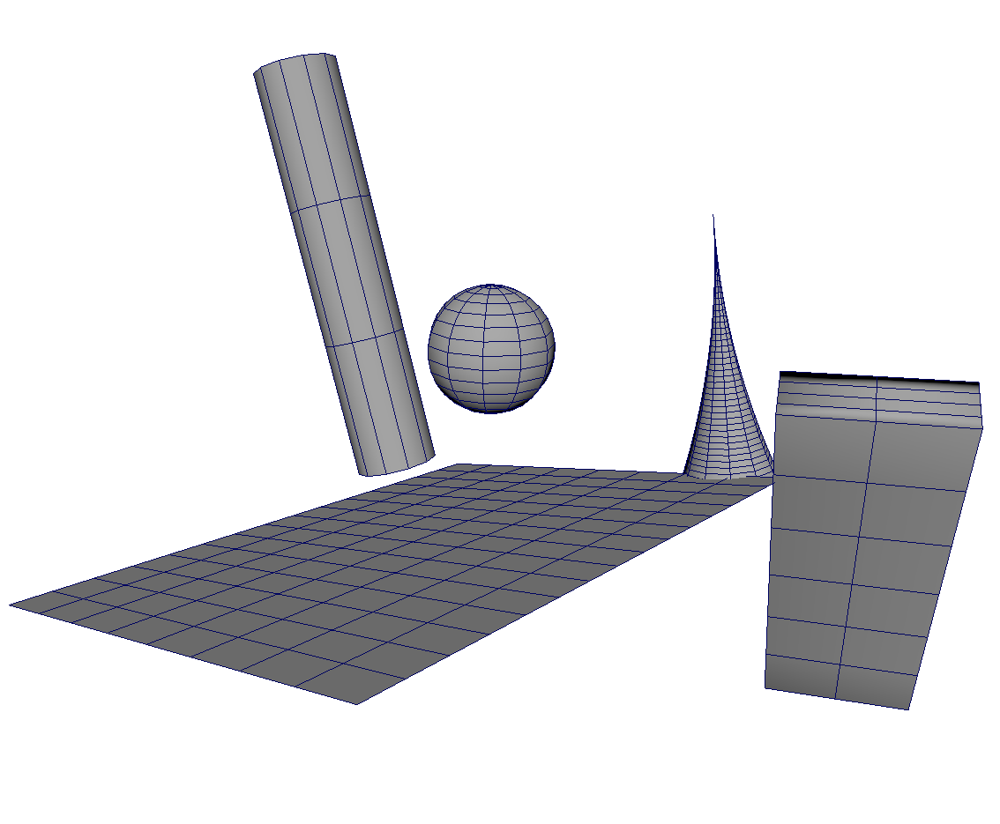
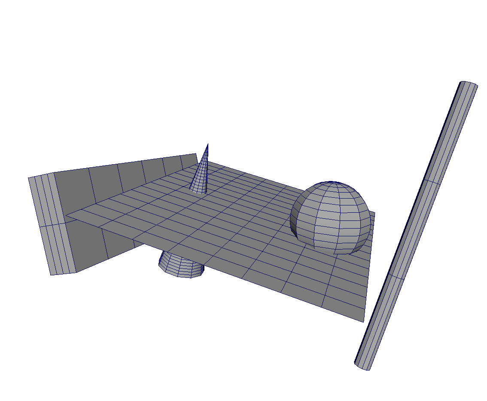

# 3Gen
Procedural 3D Environments, Trees, Grass, Flowers and Rocks Generator plug-in for Autodesk Maya.

<p align = "center">
  
</p>

## Comparing 3Gen with Maya cmds

### API comparison

3Gen API:


```python
from pg_source.pg_object.pg_maya_objects import maya_tube;
from pg_source.pg_object.pg_maya_objects import maya_plane;

# Create Tube in 3D
TUBE = maya_tube.Maya_tube(name = 'tube_1', sx = 11, sy = 3, height = 35, radius_down = 3.5, radius_up = 3.5)
TUBE.rotate(z = 70, x = 15)
TUBE.translate(0, 0, 10)
TUBE.create_object()

# Create Plane in 3D
PLANE = maya_plane.Maya_plane(name = 'plane_1', sx = 8, sy = 15, height = 40, width = 31)
PLANE.rotate(y = 30, x = 60)
PLANE.translate(0, -10, 0)
PLANE.create_object()

# Create Cone in 3D
CONE = maya_tube.Maya_tube(name = 'cone_1', sx = 11, sy = 45, height = 19.2, radius_down = 3.5, radius_up = 0, power = 2)
CONE.rotate(z = 0, x = 15)
CONE.translate(0, 3, -10)
CONE.create_object()
```

Maya cmds:

```python
import maya.cmds as cmds

# Create Cyilinder in 3D
cmds.polyCylinder(sx = 11, sy = 3, h = 35, n = 'tube_2')
cmds.setAttr('tube_2.rx', 30)
cmds.setAttr('tube_2.rz', 115)
cmds.setAttr('tube_2.tx', 10)

# Create Plane in 3D
cmds.polyPlane(sx = 8, sy = 15, h = 40, w = 31, n = 'plane_2')
cmds.setAttr('plane_2.ry', 100)
cmds.setAttr('plane_2.rz', 45)
cmds.setAttr('plane_2.tx', -15)
cmds.setAttr('plane_2.tz', 13)

# Create Cone in 3D
cmds.polyCone(sx = 11, sy = 45, h = 19.2, r = 3.5, n = 'cone_2')
cmds.setAttr('cone_2.ry', 170)
cmds.setAttr('cone_2.rz', 55)
cmds.setAttr('cone_2.tx', -14)
```

<p align = "center">
  
   
</p>

### Benchmarks

Test includes creating grid of 10.000 planes (100x100). Test was done on laptop with i5-7300HQ and 16GB of RAM

```python
n = 100 # grid width
sx = 1  # number of plane subdivisions by x axis
sy = 1  # number of plane subdivisions by y axis
h = 1   # height of each plane
w = 1   # width of each plane

# translation grid
x = np.linspace(0, n, n)
x, y = np.meshgrid(x, x)
x = x.ravel()
y = y.ravel()
```

#### Maya cmds
execution time: **~15.2 seconds**

```python
for i in range(n ** 2):

    name = 'plane_' + str(i)
    cmds.polyPlane(sx = sx, sy = sy, h = h, w = w, n = name)
    cmds.move(x[i], 0, y[i], name)
```

#### 3Gen API
execution time: **~1.5 seconds (10x speedup)**

```python
from pg_source.pg_object import pg_planes
from pg_source.pg_object import pg_plane

PLANES = pg_planes.Planes(base_name = 'plane_')

for i in range(n ** 2):
    PLANES.PLANE[i] = pg_plane.Plane(name = str(i), sx = sx, sy = sy, height = h, width = w)
    PLANES.PLANE[i].translate(x[i], 0, y[i])

PLANES.create()
```

#### 3Gen API with precalculated data
execution time: **~0.28 seconds (54x speedup)**

```python
from pg_source.pg_object import pg_planes
from pg_source.pg_object import pg_plane

from pg_source.pg_object.pg_maya_objects.plane import vtx_pos
from pg_source.pg_object.pg_maya_objects.plane import uv
from pg_source.pg_object.pg_maya_objects.plane import poly_count
from pg_source.pg_object.pg_maya_objects.plane import poly_connections

    PLANES = pg_planes.Planes(base_name = 'plane_')

    VTX_POS          = vtx_pos.Vtx_pos(sx, sy, h, w)
    UV               = uv.UV(sx, sy)
    POLY_COUNT       = poly_count.Poly_count(sx * sy)
    POLY_CONNECTIONS = poly_connections.Poly_connections(sx, sy)

    for i in range(n ** 2):

        PLANES.PLANE[i] = pg_plane.Plane(name = str(i), sx = sx, sy = sy, height = h, width = w, VTX_POS = VTX_POS, UV = UV, POLY_COUNT = POLY_COUNT, POLY_CONNECTIONS = POLY_CONNECTIONS)
        PLANES.PLANE[i].translate(x[i], 0, y[i])

    PLANES.create()
```

<p align = "center">
  
</p>

## Customizable GUI

Whole 3Gen GUI is customizable from config.json. All objects, images, parameters and their order is defined here. User can freely change this configuration file and just rerun the application.

```json
    "SUN" : {

        "CONFIG_IMAGE" : {

            "src_path_relative" : "textures/sun",
            "src_img_name"      : "sun_1"},

        "ATTRIBUTES" : {

            "intens"            : {"name" : "Ints", "minValue" :       1, "value" :      5, "maxValue" :      9, "type" :   "int", "annotation" : "Sun Intensity"},
            "x"                 : {"name" : "X"   , "minValue" : -1200.0, "value" :    0.0, "maxValue" : 1200.0, "type" : "float", "annotation" : "X position"},
            "y"                 : {"name" : "Y"   , "minValue" :   600.0, "value" : 1200.0, "maxValue" : 1800.0, "type" : "float", "annotation" : "Y position"},
            "z"                 : {"name" : "Z"   , "minValue" : -1200.0, "value" :    0.0, "maxValue" : 1200.0, "type" : "float", "annotation" : "Z position"},
            "maya_object_name"  : "Sun"}},

    "CONFIG_SKY" : {

        "CONFIG_IMAGE" : {

            "src_path_relative" : "textures/config_sky",
            "src_img_name"      : "config_sky",},

        "ATTRIBUTES" : {

            "r"                 : {"name" : "R" , "minValue" :  1000, "value" : 2000, "maxValue" : 3000, "type" :   "int", "annotation" : "Radius of Sky Dome"},
            "trl_x"             : {"name" : "tX", "minValue" : -1000, "value" :    0, "maxValue" : 1000, "type" :   "int", "annotation" : "Translate X axis"},
            "trl_y"             : {"name" : "tY", "minValue" : -1000, "value" :    0, "maxValue" : 1000, "type" :   "int", "annotation" : "Trasnalte Y axis"},
            "trl_z"             : {"name" : "tZ", "minValue" : -1000, "value" :    0, "maxValue" : 1000, "type" :   "int", "annotation" : "Translate Z axis"},
            "rot_x"             : {"name" : "rX", "minValue" :  -180, "value" :    0, "maxValue" :  180, "type" :   "int", "annotation" : "Rotate by X axis"},
            "rot_y"             : {"name" : "rY", "minValue" :  -180, "value" :    0, "maxValue" :  180, "type" :   "int", "annotation" : "Rotate by Y axis"},
            "rot_z"             : {"name" : "rZ", "minValue" :  -180, "value" :    0, "maxValue" :  180, "type" :   "int", "annotation" : "Roatet by Z axis"},
            "scl_x"             : {"name" : "sX", "minValue" :   0.5, "value" :  1.0, "maxValue" :  1.5, "type" : "float", "annotation" : "Scale by X axis"},
            "scl_y"             : {"name" : "sY", "minValue" :   0.5, "value" :  1.0, "maxValue" :  1.5, "type" : "float", "annotation" : "Scale by Y axis"},
            "scl_z"             : {"name" : "sZ", "minValue" :   0.5, "value" :  1.0, "maxValue" :  1.5, "type" : "float", "annotation" : "Scale by Z axis"},
            "maya_object_name"  : "aiSkyDomeLight1",
            "maya_texture_name" : "sky_texture"}},
```

<p align = "center">
  
</p>

## E-Gen - Procedural Environment Generator

<p align = "center">
  
</p>

Examples of procedural terrains

<p align = "center"> 
  
   
</p>

Erosion modifier:

<p align = "center">
   
   
   
   
</p>

## T-Gen - Procedural Trees Generator

<p align = "center">
   
</p>

Simple textures editing

<p align = "center">
   
   
</p>

<p align = "center"> 
  
   
  
   
</p>

## G-Gen - Procedural Grass and Flowers Generator

<p align = "center"> 
  
</p>

## M-Gen - Materials Generator

Frame Buffer Modifier and Procedural Brick-Wall Materials:

<p align = "center"> 
  
  
</p>

## S-Gen - Snapshot Generator

<p align = "center">
   
</p>

## R-Gen - Rocks Generator